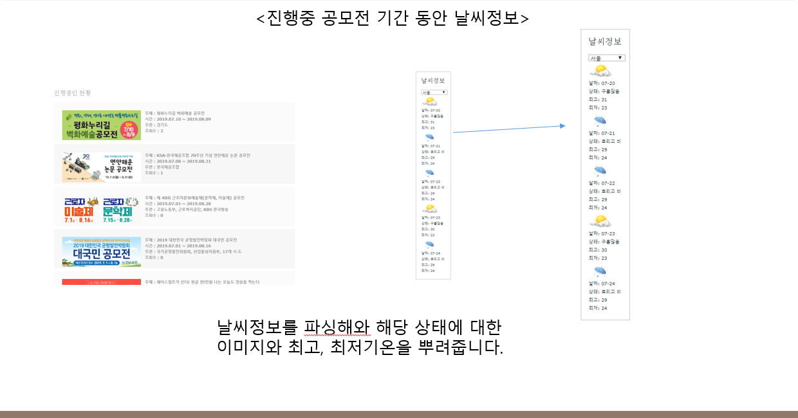

node.js Server_Programming
===

<a href="https://myengineering.tistory.com/"></a>
<a href="#"></a>
<a href="#"></a>
<a href="#"></a>

서버 프로그래밍 프로젝트

- 핵심 목표: 서버 프로그래밍을 해보자
- Keyword: node.js, javascript, Jquery, Ajax, Ejs Templete, bootstrap, Multur 모듈, Express 서버, 미들웨어, Box Slider, LightBox, Open API, FlexSlider, Parsing, 크롤링, MongoDB, Session, 반응형 웹, Server-Side, Client-Side
- 주제: 각종 공모전 컨텐츠들을 한눈에 볼 수 있도록 제공하는 웹 서비스
- 내용: 공모전 정보와 입상 후 포트폴리오 양식 지원, 공모전을 준비하는 사람들이 정보를 쉽게 얻고 자기계발 향상을 위한 서비스 제공
- 개발 기간: 2019.07 ~ 2019.08

> Readme 작성중...

<br/>

샘플 화면
---
개발 환경이 윈도우이기 때문에 윈도우 운영체제에서 실행 하였습니다.

| 메인 화면 |
|:----------------------------------------:|
||

| 지난 공모전 | 진행중인 공모전 |
|:----------------------------------------:|:-----------------------------------------:|
|||

| 포트폴리오 다운로드 | 포트폴리오 공유 |
|:----------------------------------------:|:-----------------------------------------:|
|||

<br/>

전체 사이트맵
---


<br/>

주요 기술 요소
---

| 로그인 및 회원가입 | 메인페이지 기능 |
|:----------------------------------------:|:-----------------------------------------:|
|||

| 지난 공모전-일반순,이름 정렬 | 지난 공모전-조회수,마감 정렬 |
|:----------------------------------------:|:-----------------------------------------:|
|||

| 날씨 Open API | Session 기능 |
|:----------------------------------------:|:-----------------------------------------:|
|||

| 포트폴리오 서버에 업로드 | 포트폴리오 서버에서 다운로드 |
|:----------------------------------------:|:-----------------------------------------:|
|||

<br/>

개발 과정
---

1. HTML과 javascript로 기본적인 기능이 있는 웹페이지 구성
2. node.js 모듈 설치 및 app.js 구축
3. Open API 적용(날씨 정보)
4. MongoDB 연동 및 DataBase와Collection 생성
5. 회원가입과 로그인 기능 구현(MongoDB)
6. ejs 템플릿 엔진 적용
7. 공모전 정보 Parsing(MongoDB)
8. multur 모듈을 통한 파일 업로드 구현
9. 파일 다운로드 기능 구현
10. lightBox, BoxSlider, flexSlider 적용을 통한 깔끔한 뷰 구성

<br/>

한눈에 보는 전체 시스템 구조도
---


<hr/>

| Client Side |
|:----------------------------------------:|
||
||
||

- 개발환경(Client): 
  - Light Box -> 크게보기 버튼을 누르면 light box 기능 활성화
  - Box Slider -> 이전 버튼을 누르면 이전 이미지, 다음 버튼을 누르면 다음 이미지를 보여준다.
  - 반응형 웹 구성 -> 모바일, 태블릿, 노트북 뷰를 제공하기 위해 각자 다른 사이즈를 형성
  - 오픈 API를 이용한 데이터 파싱 -> Ajax를 이용하여 외부 XML데이터를 Parsing 하여 RSS 연동
  - Jquery FlexSlider 기능 -> Jquery 라이브러리 사용하여 메인페이지에 랜덤으로 뿌려진 정보를 슬라이드 형식으로 제공
  - To Top 기능 -> 버튼을 누르면 맨 위로 올라가는 기능

<br/>
<br/>

| Server Side |
|:----------------------------------------:|
||
||

- 개발환경(Server):
  - Mongo DB를 이용한 로그인및 회원가입 -> 회원 정보를 Mongo DB를 통해 저장 해두고, 로그인 할 때 데이터와 비교후 회원 여부 확인
  - 진행중인 공모전 정보 뿌리기 -> DB에 정보를 Parsing 하여 저장 후 서버를 통해 DB에 저장된 정보를 뿌려준다. 여러방식으로 정렬 제공
  - 서버 구축 및 DB 연결 -> 3000 포트로 서버를 구축 및 DB 연결
  - 조회수 기반 정보 제공 -> 클릭 시 이벤트를 통하여 ajax를 거쳐 서버쪽으로 데이터를 보내 조회수 증가 시킨다.
  - Multur 모듈을 이용하여 파일 업로드 -> Post 방식으로 서버에 업로드 요청 후, 지정한 서버 폴더에 업로드
  - 서버 폴더에 있는 양식 다운로드 -> 경로 설정을 통해 서버에 있는 업로드 폴더에 접근 후 요청 자료 다운로드

<br/>

어떻게 실행하나요?
---
- [MongoDB 설정하기](markdown/index/MongoDB.md)
  - 위와같이 MongoDB 개발환경 셋팅을 해주어야 정상적으로 공모전 데이터가 크롤링 됩니다.
  
- 로컬 환경에서 실행하기
  - 로컬 환경이므로 Chrome이나 Internet Explorer를 킬때 localhost:3000를 주소창에 쳐야 들어가집니다.
  
***
##### ※ 프로그램 실행 순서 ※ 
  
-> 몽고DB Comunity 버전 설치

-> node.js 설치

-> cmd 창을 실행

-> cd 공모전~1 으로 change directory

-> node dbinit.js 실행

-> node dbinit2.js 실행

-> app.js 실행

-> chrome 열어서 localhost:3000 타이핑
```bash
cd 공모전~1

node dbinit.js

node dbinit2.js

app.js
```
-> 웹브라우저 localhost:3000 
맺으며
---
- 백엔드에 대해서 조금 알게되는 계기가 되었다.
- 프로젝트가 끝나고 관심이 생겨 더 공부하게 되었는데 많이 어렵다.
- 서버 공부는 빡세게 해야겠다!!!

참고 자료 출처
---
- https://mongoosejs.com/docs/documents.html - MongoDB 참고 사이트
- https://www.jqueryscript.net/popular/ - Jquery Plugin 참고 사이트
- https://www.w3schools.com/ - HTML, CSS, javascript, JQuerty 사용법 참고 사이트
- http://www.weather.go.kr/weather/lifenindustry/sevice_rss.jsp – 날씨 API Parsing 사이트
- https://www.thinkcontest.com/ - 공모전 정보 Parsing 사이트

License
---
This is released under the MIT license. See [LICENSE](LICENSE) for details.
