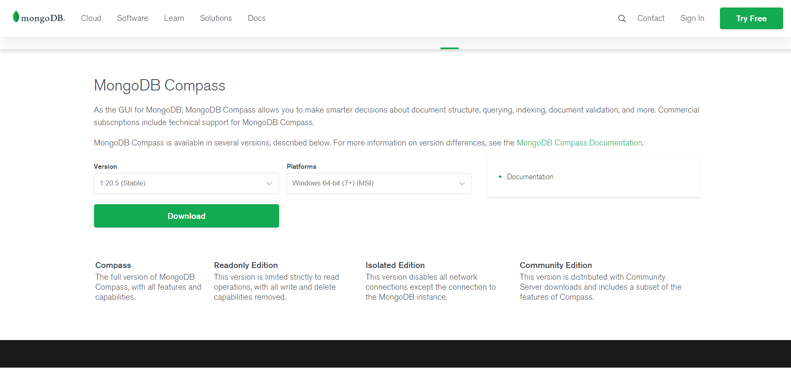
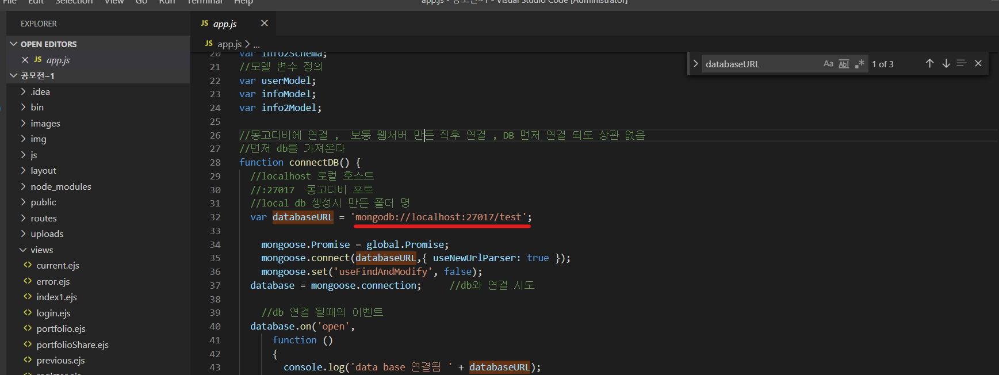
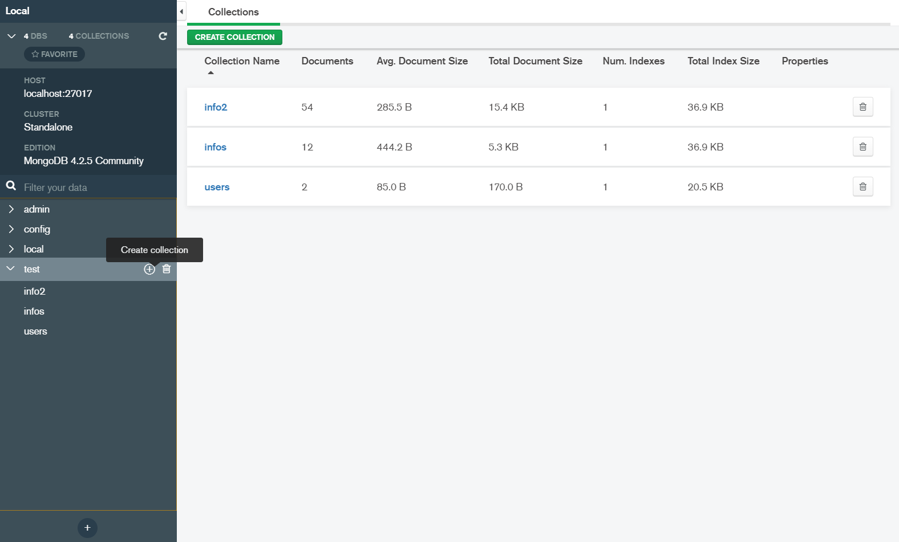

MongoDB 설치 및 설정하기
---
- 저는 MySQL의 WorkBench로 데이터베이스를 사용했더니 CMD로 MySQL 쓰는 것보다 편했습니다.

 

# 1. MongoDB Community Or MongoDB Compass 버전 둘중 하나를 운영체제에 맞게 설치한다.

 
 

# 2. 환경변수 설정하기
- [컴내퓨터] 우클릭 -> [고급시스템설정] -> [환경변수]
 
 

# 3. MongoDB와 프로젝트를 연결해주자
- MongoDB와 프로젝트를 연결해주자 (이 프로젝트의 app.js 파일에 databaseURL이 적혀있다. 
- 'mongodb://localhost:27017/test'를 복사하고 MongoDB를 키면 databaseURL을 적으라고 한다. 복사한걸 붙여주자.

# 4. DataBase를 만들어 주자
- 이 프로젝트에서는 test라는 이름으로 DataBase를 사용하고 있으므로 프로젝트 파일을 수정하기 귀찮다면 DataBase 이름을 test로 지어주자.
- test라는 DataBase에 Create Collection을 눌러서 info2, infos, users를 생성해준다.

